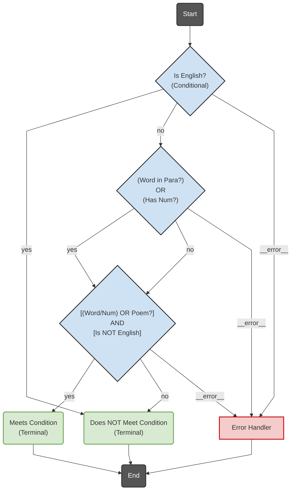

# LangGraph Decision Tree Engine

*(Generated on: Saturday, April 12, 2025 at 1:29:32 AM CEST in Munich, Bavaria, Germany)*

## Overview

This repository provides a Python-based framework for building binary decision trees using LangGraph. It allows you to create decision-making workflows that can incorporate both rule-based logic and Large Language Model (LLM) reasoning via APIs like OpenAI or local TGI instances.

The repository contains:

* `langgraph_decision_engine.py`: The core engine module, providing the fundamental building blocks (state, base nodes, LLM client logic, routing) for constructing decision graphs.
* `example_graphs.py`: A module containing specific, runnable example graph builder functions, demonstrating how to use the engine to create decision trees (e.g., simple sequential, AND gate logic, complex word/poetry analysis).
* `decision_engine_examples.ipynb`: A Jupyter Notebook that showcases how to use the modules to build, visualize, and execute the example decision graphs with sample data, presenting results clearly.

## Key Features

* **Modular Design:** Clean separation between the core engine (`langgraph_decision_engine.py`) and specific graph implementations (`example_graphs.py`).
* **Flexible Decision Nodes:** Supports both:
    * Simple conditional decisions using Python functions based on input data.
    * LLM-powered decisions using OpenAI API or TGI/OpenAI-compatible endpoints, leveraging robust **Tool Calling** for structured boolean outputs.
* **Logical Combinations:** Provides nodes for combining decision results using AND, OR, and NOT logic gates.
* **Binary Decision Trees:** Designed for creating decision trees where branches are determined by binary ("yes"/"no") outcomes.
* **State Management:** Uses LangGraph's state mechanism (`TypedDict`) to manage data flow through the graph nodes.
* **Conditional Debugging:** Includes an optional debug mode (controlled by the `LANGGRAPH_DEBUG` environment variable) to provide verbose logging during execution without cluttering standard runs.
* **Visualization:** Functionality included in the example notebook to generate graph visualizations using Mermaid syntax or render them directly as PNGs (requires optional dependencies).
* **Example Usage:** The Jupyter Notebook (`decision_engine_examples.ipynb`) provides clear, runnable examples demonstrating graph construction, visualization, execution, and results presentation using Pandas.

## Requirements

* Python 3.8+ (Tested with 3.11)
* LangGraph (`pip install langgraph`)
* LangChain OpenAI (`pip install langchain-openai`) - Includes `langchain-core`
* Pydantic (`pip install pydantic`) - LangChain now uses Pydantic v2
* python-dotenv (Optional, for loading environment variables from a `.env` file: `pip install python-dotenv`)

**Optional Dependencies (for visualization in the notebook):**

* Pandas (For results display): `pip install pandas`
* IPython (For `display`): Usually comes with Jupyter. `pip install ipython`
* For direct PNG rendering of graphs:
    * **Method 1:**
        * pygraphviz (`pip install pygraphviz`)
        * Graphviz system library (e.g., `sudo apt-get install graphviz` on Debian/Ubuntu, `brew install graphviz` on macOS).
    * **Method 2:**
        * playwright (`pip install playwright`)
        * Browser binaries for Playwright: `playwright install` (run in terminal)

## Installation

1.  **Clone the repository:**
    ```bash
    git clone <repository_url>
    cd <repository_name>
    ```

2.  **(Recommended) Create and activate a virtual environment:**
    ```bash
    python3 -m venv venv
    source venv/bin/activate  # On Linux/macOS
    # venv\Scripts\activate  # On Windows PowerShell
    # venv\Scripts\activate.bat # On Windows Command Prompt
    ```

3.  **Install core dependencies:**
    ```bash
    pip install langgraph langchain-openai pydantic python-dotenv pandas ipython
    ```

4.  **(Optional) Install visualization dependencies:** Choose Method 1 or Method 2 if you want direct PNG rendering in the notebook.
    ```bash
    # Method 1 (Requires system Graphviz)
    pip install pygraphviz
    # OR Method 2
    pip install playwright
    playwright install
    ```

## Configuration

Configure your LLM connection using environment variables. You can set these globally or create a `.env` file in the root directory of the repository.

* **`LLM_API_TYPE`**: (Optional) Set to `"OPENAI"` or `"TGI"`. **Defaults to `"OPENAI"`**.
* **`


## Example Langgraph graph:

```mermaid
---
config:
  flowchart:
    curve: linear
---
graph TD;
    %% Node Definitions (Simplified Syntax with <br/> and Abstraction)
    __start__("Start"):::startEndNode
    wp_check_is_english{"Is English?<br/>(Conditional)"}:::conditionalNode
    wp_check_word_or_num{"(Word in Para?)<br/>OR<br/>(Has Num?)"}:::conditionalNode
      %% Abstracted Node 1
    wp_check_final_condition{"[(Word/Num) OR Poem?]<br/>AND<br/>[Is NOT English]"}:::conditionalNode
      %% Abstracted Node 2 (Represents final AND logic outcome)
    wp_terminal_meets_condition("Meets Condition<br/>(Terminal)"):::terminalNode
    wp_terminal_does_not_meet_condition("Does NOT Meet Condition<br/>(Terminal)"):::terminalNode
    wp_error_handler_complex["Error Handler"]:::errorNode
    __end__("End"):::startEndNode

    %% Edges (Connections - Manually Rerouted for Abstraction)
    __start__ --> wp_check_is_english;

    wp_error_handler_complex --> __end__;
    wp_terminal_does_not_meet_condition --> __end__;
    wp_terminal_meets_condition --> __end__;

    %% If English, fails condition
    wp_check_is_english -- "yes" --> wp_terminal_does_not_meet_condition;
    %% If not English, check the combined Word/Number condition
    wp_check_is_english -- "no" --> wp_check_word_or_num;
    wp_check_is_english -- "__error__" --> wp_error_handler_complex; %% Error from initial check

    %% After checking Word OR Num, check the final combined condition (including Is Poem?)
    wp_check_word_or_num -- "yes" --> wp_check_final_condition;
    wp_check_word_or_num -- "no" --> wp_check_final_condition;
    wp_check_word_or_num -- "__error__" --> wp_error_handler_complex; %% Represent potential errors from underlying checks

    %% Route based on the final abstracted condition result
    wp_check_final_condition -- "yes" --> wp_terminal_meets_condition;
    wp_check_final_condition -- "no" --> wp_terminal_does_not_meet_condition;
    wp_check_final_condition -- "__error__" --> wp_error_handler_complex; %% Represent potential errors from underlying checks


    %% Class Definitions (Styling - Kept the same)
    classDef conditionalNode fill:#cfe2f3,stroke:#333,stroke-width:2px;
    classDef llmNode fill:#d9d2e9,stroke:#333,stroke-width:2px,color:#000000;
    classDef gateNode fill:#fce5cd,stroke:#e69138,stroke-width:2px;
    classDef terminalNode fill:#d9ead3,stroke:#6aa84f,stroke-width:2px;
    classDef actionNode fill:#f3f3f3,stroke:#666,stroke-width:2px,stroke-dasharray: 5 5;
    classDef classificationNode fill:#d0e0e3,stroke:#45818e,stroke-width:2px;
    classDef errorNode fill:#f4cccc,stroke:#cc0000,stroke-width:2px;
    classDef unknownNode fill:#eee,stroke:#333,stroke-width:1px;
    classDef startEndNode fill:#555,stroke:#333,stroke-width:2px,color:#fff;

```

### Equivalent low level langgraph graph:


